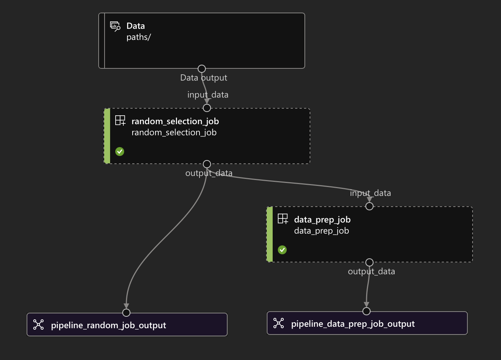

# Intent
Showcase a simple 2-step Azure ML pipeline with sample data taken from [Federal Housing Finance Agency
datasets](https://www.fhfa.gov/DataTools/Downloads/Pages/House-Price-Index-Datasets.aspx#mpo). The goal is to
show how a pipeline can be configured, with the new Azure ML Python SDK v2. To initiate this workflow, follow
the steps in the `Makefile`. To start, create a file called `sub.env` in the root of this directory and update
it with this line: `SUB_ID=<your subscription key>`. On successful completion, you should see the pipeline
below:

